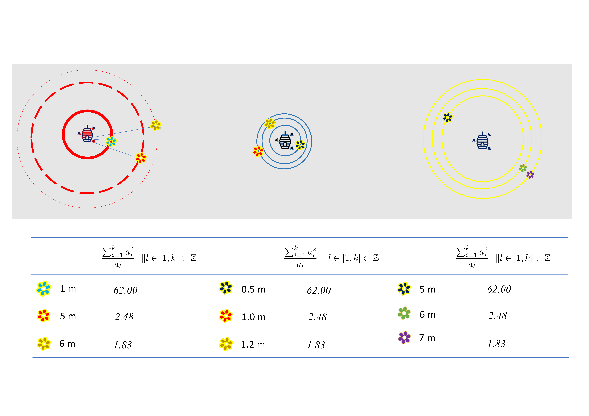

```{r, include = FALSE}
knitr::opts_chunk$set(
  collapse = TRUE,
  comment = "#>",
	fig.width = 12, 
	message = FALSE,
	warning = FALSE,
	tidy.opts = list(
		keep.blank.line = TRUE,
		width.cutoff = 150
		),
	options(width = 150),
	eval = TRUE
)
library(geospat)
```

# 1. Motivation of analysis.
__*geospat*__ is an R package for calculation of *weighted Sum of Distance from Grids (wSDG)*. The *wSDG* is an estimate of relative workload, calculated on each facility from geo-information (e.g., longitude and latitude) of the facilities and spatial distribution of the users with weight, e.g., population. This algrithm was developped to estimate workloads in community pharmacies taking acount for inconsistency between distributions of pharmacies and population densities. In this vignette, an explanation of the algorithm is presented, using a toy-example with flowers and beeswarm in grassland. The analysis can be conducted from the `wSDG()` function in this package.

# 2. A toy example -- a grassland.
In advance, I would like to point out that I'm not an entomologist; so 


```{r echo=FALSE, label=Fig.1, out.width = "85%",  fig.cap = "A toy example -- beeswarms and flowers in grass land."}
require(knitr)
include_graphics("Fig1.png")
```
```{r echo=FALSE, label=Fig.2, out.width = "85%",  fig.cap = "Stepping into bees' shoes, flowers bloom at whimsical points around their swarms."}
require(knitr)
include_graphics("Fig2.png")
```

# 3. The algorithm.
Initially, 
$\frac{\sum_{i=1}^{k}{a_i^2}}{a_l}\ \ \| l \in [1,k]\subset \mathbb{Z}$

```{r echo=FALSE, label=Fig.3, out.width = "85%",  fig.cap = "Results from the algorithm 1: *wSDG*."}
require(knitr)

```
